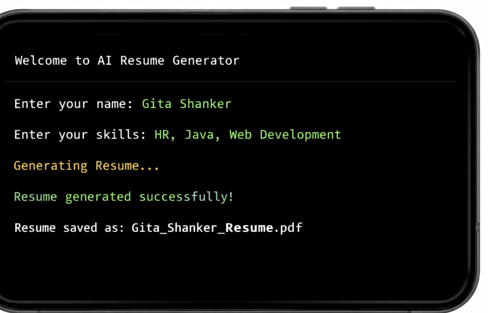

# AI Resume & Cover Letter Generator

## Project Overview
This project is an AI-powered application that generates professional resumes and cover letters based on user input.  
It demonstrates automation in content creation, improving efficiency and formatting consistency.

## Features
- Generates customized resumes
- Generates professional cover letters
- Structured formatting logic
- Clean output display

## Technologies Used
- Python 3.x
- File handling
- AI-assisted content generation

## How It Works
1. User enters personal and professional details.
2. The program processes the input using structured AI logic.
3. A professional resume and cover letter are generated.
4. Output is displayed on screen or saved as a file.
   
## Sample Output
- Resume: [sample_resume.pdf](outputs/sample_resume.pdf)
- Cover Letter: [sample_coverletter.pdf](outputs/sample_coverletter.pdf)

## Future Improvements
- Add a web interface for easier user input
- Export directly as PDF or Word documents
- Include more AI customization options for formatting

## Author
Gita Shanker
